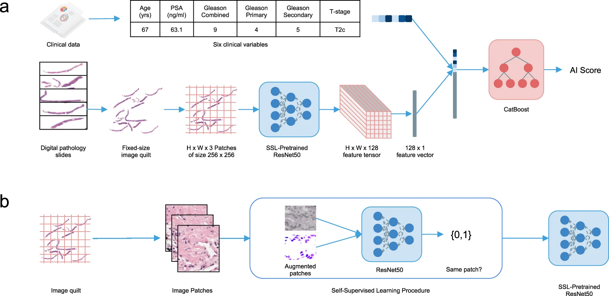

---
# Leave the homepage title empty to use the site title
title: Mars Huang
date: 2022-10-24
type: landing

sections:
  - block: about.avatar
    id: about
    content:
      # Choose a user profile to display (a folder name within `content/authors/`)
      username: admin
      # Override your bio text from `authors/admin/_index.md`?
      text:
  - block: collection
    id: featured
    content:
      count: 7
      title: Featured Publications
      filters:
        folders:
          - publication
        featured_only: true
    design:
      columns: '2'
      view: card
  - block: collection 
    id: publications
    content:
      count: 20
      title: All Publications
      text: |-
        {}
        Quickly discover relevant content by [filtering publications](./publication/).
        {}
      filters:
        folders:
          - publication
        exclude_featured: false
    design:
      columns: '2'
      view: citation
  - block: experience
    id: experiences
    content:
      title: Experience
      # Date format for experience
      #   Refer to https://wowchemy.com/docs/customization/#date-format
      date_format: Jan 2006
      # Experiences.
      #   Add/remove as many `experience` items below as you like.
      #   Required fields are `title`, `company`, and `date_start`.
      #   Leave `date_end` empty if it's your current employer.
      #   Begin multi-line descriptions with YAML's `|2-` multi-line prefix.
      items:
        - title: AI Research Summer Intern
          company: Salesforce
          company_url: 'https://www.salesforceairesearch.com/'
          company_logo: org-s
          location: San Francisco
          date_start: '2021-06-01'
          date_end: '2021-09-01'
          description: |2-
              Designed and implemented a multimodal self-supervised framework for prostate cancer long-term outcome prediction.

              

              [Project Link](https://www.nature.com/articles/s41746-022-00613-w)
        - title: Computational Biology Summer Intern 
          company: Chan Zuckerberg Initiative (CZI)
          company_url: 'https://chanzuckerberg.com/'
          company_logo: org-czi
          location: Redwood City
          date_start: '2019-06-01'
          date_end: '2019-09-01'
          description: |2-
              Created Segmentify, an interactive and general-purpose cell segmentation plugin for the image viewer Napari

              

              [Project Link](https://github.com/transformify-plugins/segmentify)
        - title: Research Programmer
          company: San Diego Supercomputer Center
          company_url: 'https://www.sdsc.edu/'
          company_logo: org-sdsc
          location: San Diego
          date_start: '2015-03-01'
          date_end: '2016-12-01'
          description: |2-
              Developed mmtf-pyspark, a python package that parallelizes analysis and mining of protein data using Apache-Spark

              

              [Project Link](https://github.com/sbl-sdsc/mmtf-pyspark)
    design:
      columns: '2'
  - block: markdown
    id: photos
    content:
      title: Amature Photography
      subtitle: ''
      text: |-
        
    design:
      columns: '1' 
---
